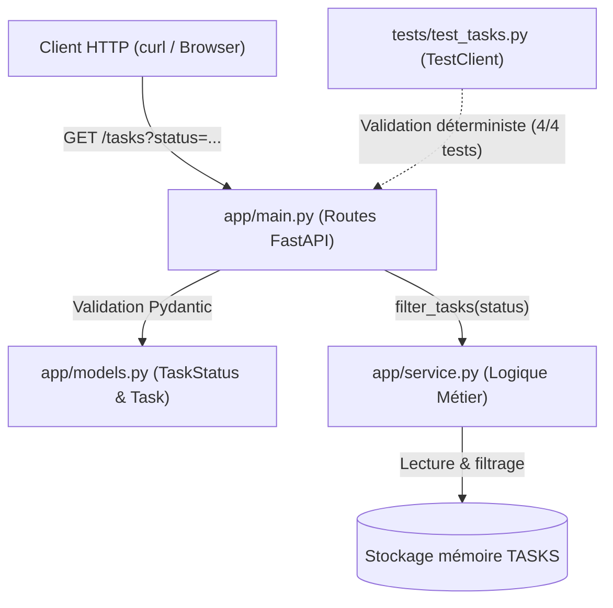

# Architecture logicielle & Flux de données (`ARCHITECTURE.md`)

> **Note :** Ce document est maintenu automatiquement par le skill d'agent `.kilo/skills/document-architecture`.

---

## 1. Vue d'ensemble du système

L'application est une API REST développée avec **FastAPI** et **Pydantic**, appliquant un typage strict et une séparation nette entre point d'entrée HTTP, logique métier et validation des types.



---

## 2. Modèles de données (`app/models.py`)

### Énumération `TaskStatus`
Énumération stricte des états autorisés pour une tâche :
| Valeur | Description |
| :--- | :--- |
| `todo` | Tâche à faire (état initial) |
| `doing` | Tâche en cours de traitement |
| `done` | Tâche terminée |

### Modèle `Task`
| Champ | Type | Contrainte / Défaut | Description |
| :--- | :--- | :--- | :--- |
| `id` | `int` | Obligatoire, auto-incrémenté | Identifiant unique |
| `title` | `str` | Obligatoire, non vide | Libellé de la tâche |
| `status` | `TaskStatus` | Défaut : `TaskStatus.TODO` | Statut contrôlé par l'énumération |
| `created_at` | `datetime` | Défaut : `datetime.utcnow` | Horodatage de création |

---

## 3. Spécification des Endpoints REST (`app/main.py`)

| Méthode | Route | Paramètre de requête | Code HTTP | Réponse / Comportement |
| :--- | :--- | :--- | :--- | :--- |
| `GET` | `/tasks` | *(aucun)* | `200 OK` | Retourne **toutes** les tâches existantes en mémoire |
| `GET` | `/tasks?status=done` | `status: TaskStatus` | `200 OK` | Filtre et retourne uniquement les tâches correspondantes |
| `GET` | `/tasks?status=invalide` | `status=...` | `422 Unprocessable Entity` | **Rejet strict automatique** par Pydantic |

---

## 4. Chaîne de validation déterministe

Avant toute livraison ou merge de code, la suite de contrôle déterministe du projet doit être verte à 100 % :

```bash
make demo-check
```

Cette commande exécute séquentiellement :
1. `pytest` : suite de tests automatisés (couverture cas nominal, non-régression et rejet 422).
2. `ruff check .` : analyse statique et règles de linter.
3. `ruff format --check .` : conformité stricte du formatage de code.
4. `mypy app` : vérification stricte du typage statique (zéro `Any` implicite).

