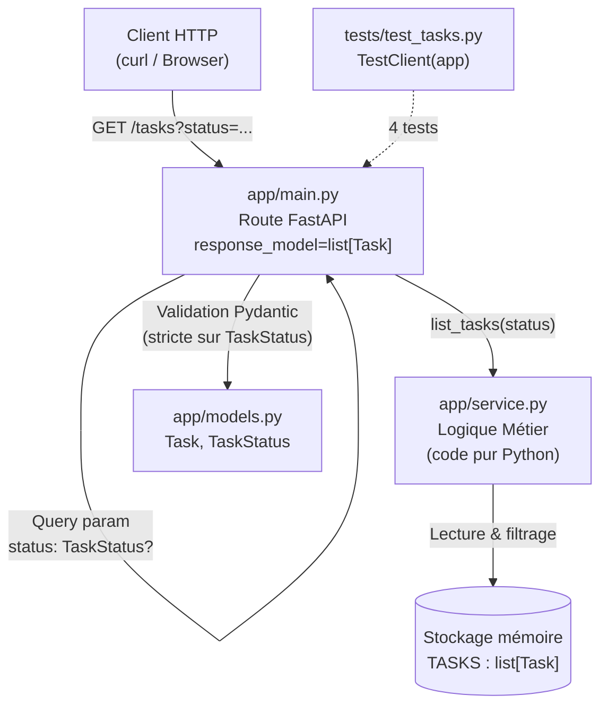

# Architecture logicielle & Flux de données

Document d'architecture généré par le skill `document-architecture`
([`.agents/skills/document-architecture/SKILL.md`](.agents/skills/document-architecture/SKILL.md)).
Il décrit la structure du code, les flux de données et les points de vérification
déterministe pour ce dépôt.

---

## 1. Vue d'ensemble & rôle du projet

Ce dépôt est une **application FastAPI minimale** conconcue pour démontrer le
développement logiciel augmenté par IA sous contrôle humain strict. L'API expose
une ressource `Task` (tâche) et permet de lister les tâches, éventuellement filtrées
par statut. Aucune base de données externe n'est utilisée : l'état est conservé en
mémoire vive dans le module `app/service.py`.

Le code suit une séparation stricte des responsabilités :

| Couche | Module | Rôle |
| :--- | :--- | :--- |
| API | `app/main.py` | Déclare les routes FastAPI, valide les paramètres de requête via Pydantic, délègue au service. |
| Modèles | `app/models.py` | Définit les schémas de données Pydantic et les énumérations (types fermés). |
| Métier | `app/service.py` | Implémente la logique de filtrage pur Python, sans dépendance HTTP/FastAPI. |
| Tests | `tests/test_tasks.py` | Tests d'intégration avec `TestClient`, validant le comportement nominal, le filtrage et le rejet 422. |

### Schéma d'architecture


```mermaid
graph TD
    Client["Client HTTP <br/> (curl / Browser)"]
    Client -- "GET /tasks?status=..." --> API["app/main.py <br/> Route FastAPI <br/> response_model=list[Task]"]
    API -- "Query param <br/> status: TaskStatus?" --> API
    API -- "list_tasks(status)" --> Service["app/service.py <br/> Logique Métier <br/> (code pur Python)"]
    Service -- "Lecture & filtrage" --> Memory[("Stockage mémoire <br/> TASKS : list[Task]")]
    API -- "Validation Pydantic <br/> (stricte sur TaskStatus)" --> Models["app/models.py <br/> Task, TaskStatus"]
    Tests["tests/test_tasks.py <br/> TestClient(app)"] -. "4 tests" .-> API
```

---

## 2. Dictionnaire des données

### 2.1 Énumération `TaskStatus` — `app/models.py`

Type **fermé** (`str, Enum`). Toute valeur non appartenant à cette énumération
est rejetée par Pydantic avec un code `422 Unprocessable Entity`.

| Membre | Valeur sérialisée | Description |
| :--- | :--- | :--- |
| `TODO` | `"todo"` | Tâche à faire (état initial) |
| `DOING` | `"doing"` | Tâche en cours de traitement |
| `DONE` | `"done"` | Tâche terminée |

### 2.2 Modèle `Task` — `app/models.py`

Schéma Pydantic (hérite de `BaseModel`).

| Champ | Type | Obligatoire | Description |
| :--- | :--- | :--- | :--- |
| `id` | `int` | Oui | Identifiant unique de la tâche |
| `title` | `str` | Oui | Libellé de la tâche |
| `status` | `TaskStatus` | Oui | Statut contrôlé par l'énumération fermée |

### 2.3 Données en mémoire — `app/service.py`

La liste `TASKS` contient trois tâches initiales :

| `id` | `title` | `status` |
| :--- | :--- | :--- |
| `1` | Lire le brief | `DONE` (`"done"`) |
| `2` | Préparer le plan | `DOING` (`"doing"`) |
| `3` | Répéter la démonstration | `TODO` (`"todo"`) |

> **Immutabilité défensive** : `list_tasks` renvoie `TASKS.copy()` ou une nouvelle
> liste filtrée — jamais la référence interne du stockage — afin d'empêcher toute
> altération accidentelle de l'état en mémoire.

---

## 3. Spécification des endpoints API

Toute la logique de route est concentrée dans `app/main.py`. Aucun appel réseau
externe n'est effectué ; l'API peut être lancée localement avec
`make demo-run-api` (uvicorn sur `127.0.0.1:8000`).

### `GET /tasks`

| Attribut | Valeur |
| :--- | :--- |
| **Méthode** | `GET` |
| **URL** | `/tasks` |
| **Réponse** | `list[Task]` (JSON) — `response_model=list[Task]` |

#### Paramètre de requête

| Paramètre | Type | Obligatoire | Description |
| :--- | :--- | :--- | :--- |
| `status` | `TaskStatus \| None` | Non | Filtre optionnel sur le statut. |

- Lorsque `status` est omis (`None`), **toutes** les tâches sont renvoyées.
- Lorsque `status` est fourni, seules les tâches dont `status` correspond sont renvoyées.
- FastAPI déduit le type à partir de l'annotation `Annotated[TaskStatus | None, Query(...)]`,
  ce qui garantit la validation stricte (règle B008 respectée : aucune fonction appelée
  dans une valeur par défaut d'argument d'endpoint).

#### Codes de retour

| Code HTTP | Scénario |
| :--- | :--- |
| `200 OK` | Liste des tâches (toutes ou filtrées selon le paramètre `status`). |
| `422 Unprocessable Entity` | La valeur fournie pour `status` n'appartient pas à l'énumération `TaskStatus` (ex. `?status=blocked`). |

#### Exemples de réponse

Requête sans filtre — `GET /tasks` :

```json
[
  {"id": 1, "title": "Lire le brief", "status": "done"},
  {"id": 2, "title": "Préparer le plan", "status": "doing"},
  {"id": 3, "title": "Répéter la démonstration", "status": "todo"}
]
```

Filtrage par statut — `GET /tasks?status=todo` :

```json
[
  {"id": 3, "title": "Répéter la démonstration", "status": "todo"}
]
```

Valeur invalide — `GET /tasks?status=blocked` :

```json
{
  "detail": [
    {
      "type": "enum",
      "loc": ["query", "status"],
      "msg": "Input should be `todo`, `doing` or `done`",
      "input": "blocked",
      "url": "https://errors.pydantic.dev/..."
    }
  ]
}
```

---

## 4. Chaîne de vérification déterministe

Avant de déclarer une tâche terminée, exécuter la commande de validation du projet :

```bash
make demo-check
```

Cette cible exécute séquentiellement :

| Étape | Commande | Outil | Rôle |
| :--- | :--- | :--- | :--- |
| 1 | `pytest` | pytest | Suite de tests d'intégration (4 cas). |
| 2 | `ruff check .` | ruff | Analyse statique et linting. |
| 3 | `ruff format --check .` | ruff | Conformité du formatage de code. |
| 4 | `mypy app` | mypy | Vérification stricte du typage (Python 3.10). |

Chaque étape doit réussir à 100 % pour valider un changement.

---

## 5. Références croisées

| Élément | Emplacement |
| :--- | :--- |
| Configuration du projet | `pyproject.toml` |
| Orchestration des tâches de validation | `Makefile` |
| Règles d'architecture (Séparation / Immutabilité / Sobriété) | `.agents/rules/architecture.md` |
| Standards Python (typage, Ruff, B008) | `.agents/rules/python.md` |
| Stratégie de tests | `.agents/rules/testing.md` |
| Gouvernance & traçabilité (`plans/`) | `AGENTS.md` |
